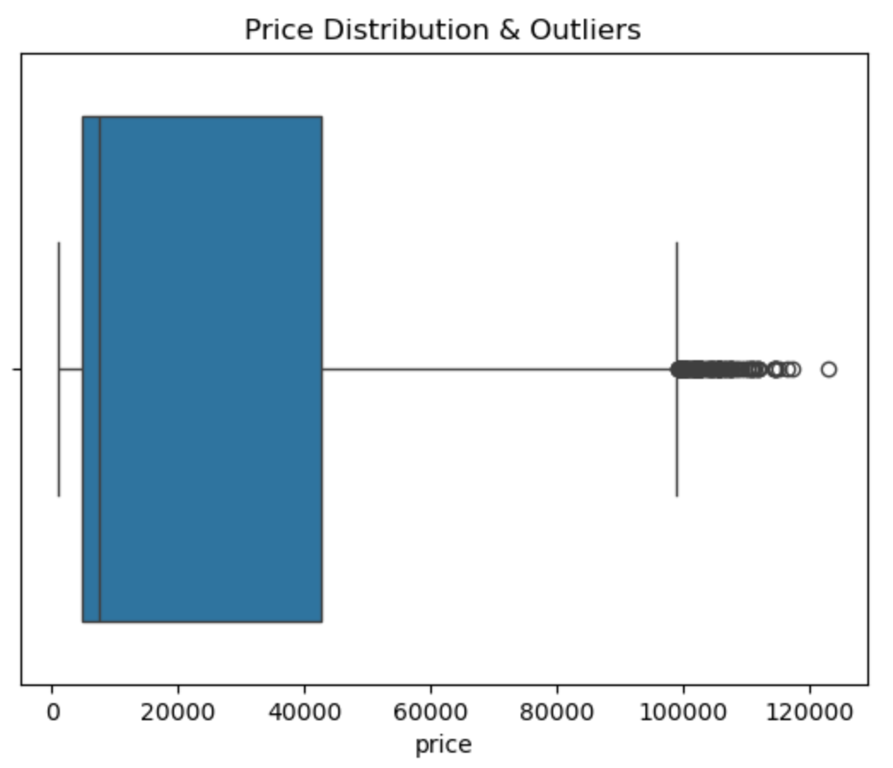
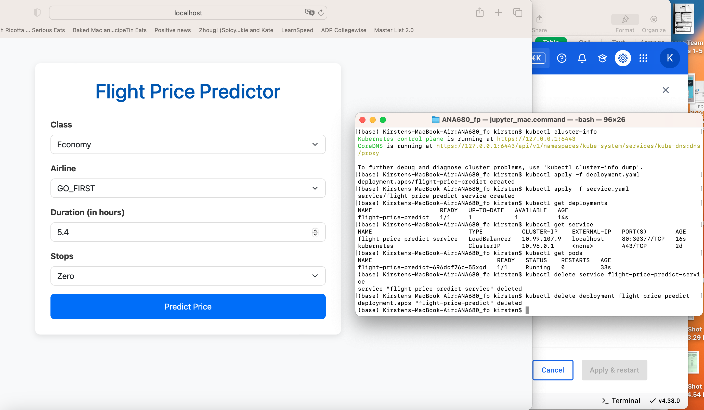

# Flight Price Prediction Model

## Overview

This project involves the creation of a machine learning model that predicts flight prices based on input features such as **class**, **airline**, **duration**, and **number of stops**. The project covers the full development lifecycle from data exploration and preprocessing to deployment in various environments such as **Flask**, **Docker**, **Heroku**, **AWS SageMaker**, and **Kubernetes**.

## Problem Statement

In the airline industry, understanding and predicting flight prices can be a challenging task, as prices fluctuate depending on multiple factors. This project aims to build a machine learning model that predicts flight prices based on key input features.

### Why Machine Learning?
Machine learning is a great tool to predict flight prices because it can handle large datasets with multiple variables and uncover hidden relationships between features. By using machine learning, we can develop a model that predicts flight prices accurately and at scale, assisting both consumers and airlines in better understanding flight pricing patterns.

## 📊 Dataset

The dataset used in this project is the **Flight Price Prediction 2025 Regression** dataset, available on [Kaggle](https://www.kaggle.com/code/didanfariz/flight-price-prediction-2025-regression).

It contains **300,153 flight records** with **12 columns**, covering both categorical and numerical features relevant to flight pricing.

### 🔢 Dataset Overview

| Column Name        | Data Type | Description |
|--------------------|-----------|-------------|
| `Unnamed: 0`       | `int64`   | Index column (can be ignored) |
| `airline`          | `object`  | Name of the airline (e.g., Air India, Vistara, Indigo) |
| `flight`           | `object`  | Flight number (used for identification only) |
| `source_city`      | `object`  | Departure city |
| `departure_time`   | `object`  | Time of departure (Morning, Night, etc.) |
| `stops`            | `object`  | Number of stops (`zero`, `one`, `two_or_more`) |
| `arrival_time`     | `object`  | Time of arrival |
| `destination_city` | `object`  | Arrival city |
| `class`            | `object`  | Travel class (`Economy`, `Business`) |
| `duration`         | `float64` | Total duration of the flight in hours |
| `days_left`        | `int64`   | Days left until the departure date (proxy for booking lead time) |
| `price`            | `int64`   | Target variable — ticket price in INR |

### ✅ Key Features Used for Modeling

After exploratory analysis and correlation inspection, the following features were found to be most influential in predicting flight price:

- **`class`**: Strongest predictor of price — Business class is significantly more expensive than Economy.
- **`airline`**: Pricing strategies vary greatly between carriers.
- **`duration`**: Longer flights tend to be priced higher.
- **`stops`**: More stops generally correlate with lower ticket prices, but not always linearly.

These selected features were used to train the final machine learning model.


## Steps Taken in This Project

### 1. 🧹 Data Exploration and Cleaning

- Inspected null values, datatypes, and feature distributions
- Handled missing values and inconsistent labels
- Converted date-time features to relevant numerical values (e.g., days left before departure)

---

### 2. 🛠️ Feature Engineering and Selection

- Performed **one-hot encoding** for initial feature exploration
- Conducted **correlation analysis** to determine the strongest predictors:

**Most positively correlated with price:**
- `class_Business`: +0.94
- `airline_Vistara`: +0.36
- `duration`: +0.20
- `stops_one`: +0.20

**Most negatively correlated:**
- `class_Economy`: -0.94
- `airline_Indigo`: -0.28
- `stops_zero`: -0.19

- Simplified the dataset by retaining only the most impactful features:
  - `class`, `airline`, `duration`, `stops`
 
---

### 3. 📉 Outlier Detection and Removal

To improve model performance:
- Created a boxplot of `price` to visualize outliers:
  
  

  
- Used the IQR method to remove price outliers:

```python
Q1 = df['price'].quantile(0.25)
Q3 = df['price'].quantile(0.75)
IQR = Q3 - Q1

lower_bound = Q1 - 1.5 * IQR
upper_bound = Q3 + 1.5 * IQR

df_cleaned = df_filtered[(df['price'] >= lower_bound) & (df['price'] <= upper_bound)]
```

---

### 4. 🔄 Feature Encoding for Modeling

To reduce model complexity and improve performance:

Replaced one-hot encoding with label encoding:

```python
from sklearn.preprocessing import LabelEncoder

label_encoder = LabelEncoder()
df_cleaned['airline'] = label_encoder.fit_transform(df_cleaned['airline'])
df_cleaned['class'] = df_cleaned['class'].map({'Economy': 0, 'Business': 1}).astype(int)
df_cleaned['stops'] = df_cleaned['stops'].map({'zero': 0, 'one': 1, 'two_or_more': 2}).astype(int)
```

---

### 5. 🤖 Model Training and Evaluation

Used two approaches:

- **Baseline**: Linear Regression  
- **Optimized**: Decision Tree Regressor with hyperparameter tuning

#### 📌 RandomizedSearchCV for Decision Tree

```python
from sklearn.model_selection import RandomizedSearchCV

param_grid = {
    'criterion': ['squared_error', 'absolute_error'],
    'max_depth': [3, 5, 10, None],
    'max_features': ['sqrt', 'log2', None],
    'min_samples_split': [2, 5, 10],
    'min_samples_leaf': [1, 2, 4],
}

random_search = RandomizedSearchCV(model, param_distributions=param_grid, 
                                   n_iter=10, cv=3,
                                   scoring='neg_mean_squared_error', 
                                   n_jobs=-1, verbose=1, random_state=88)

random_search.fit(X_train, y_train)
```

**Best Parameters Found:**

```text
{
  'min_samples_split': 2,
  'min_samples_leaf': 4,
  'max_features': 'log2',
  'max_depth': None,
  'criterion': 'squared_error'
}
```

#### 📊 Model Evaluation

| Metric       | Decision Tree | Linear Regression |
|--------------|----------------|------------------|
| R² Score     | ~0.85          | ~0.85            |
| MAE          | 3,523          | 1,500            |
| RMSE         | 5,361          | 2,000            |

While Decision Tree had more complexity, Linear Regression performed better on unseen data — likely due to lower overfitting. Therefore, decided to move forward with deploying Linear Regression model. Saved model using **joblib**.

---

### 6. 🌐 Local Deployment with Flask

- Created a Flask application that exposes the trained model as a web API.
- The API allows users to make POST requests with flight features and receive predicted flight prices. 
- Tested locally on `localhost:5000`

---

### 7. 🐳 Containerization with Docker

- Dockerized the Flask application so it could be easily deployed in any environment.
- Pushed the Docker image to **Docker Hub** for distribution and deployment. 
- Tested containerized deployment:

```bash
docker build -t flight-price-app .
docker run -p 5000:5000 flight-price-app
```

---

### 8. **CI/CD Pipeline and Heroku Deployment**
- Implemented a CI/CD pipeline using GitHub Actions to automate testing and deployment.
- Deployed the Flask application with the trained model on **Heroku** for easy access over the internet.

---

### 9. **Recreating the Project in AWS SageMaker Studio Lab**
- Replicated the entire project using **AWS SageMaker Studio Lab**.
- Used **containers** to deploy the model within the AWS ecosystem.
- [View AWS SageMaker Notebook (PDF)](Images/AWS_Deployment.pdf)

---

### 10. **Kubernetes Deployment**
- Created a Kubernetes configuration file to deploy the model on a Kubernetes cluster.
- Deployed the model to a Kubernetes cluster and exposed it to the web using a service.
  


---

### 11. **Demonstration**
- Scheduled a demonstration with the instructor via Zoom to showcase the working of the project, including the CI/CD pipeline, Docker containerization, and deployment.

---

## Key Technologies Used

- **Machine Learning**: Scikit-learn, Pandas, NumPy
- **Flask**: For creating the REST API for model inference
- **Docker**: For containerizing the Flask application
- **Heroku**: For cloud-based deployment
- **AWS SageMaker**: For running the project in the cloud with containers
- **Kubernetes**: For container orchestration and deployment

## Files Included

- **flight_price_model.pkl**: The trained machine learning model in pickle format.
- **app.py**: The Flask application that serves the model.
- **Dockerfile**: The Dockerfile to build the container for the application.
- **deployment.yaml**: The Kubernetes configuration file to deploy the model.
- **requirements.txt**: Python dependencies for the project.
- **GitHub Actions configuration**: CI/CD pipeline configuration for automated testing and deployment.

## Conclusion

This project demonstrates how to take a machine learning model from development to production using a range of technologies including Flask, Docker, AWS, and Kubernetes. The final product is a scalable, containerized web service that predicts flight prices based on user input.
